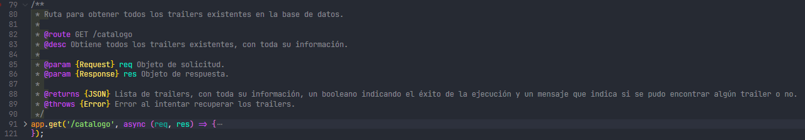
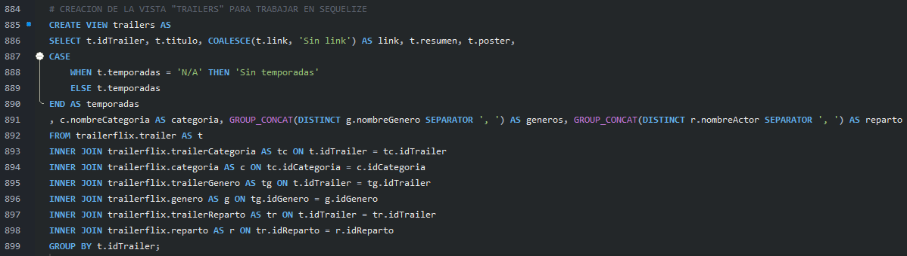
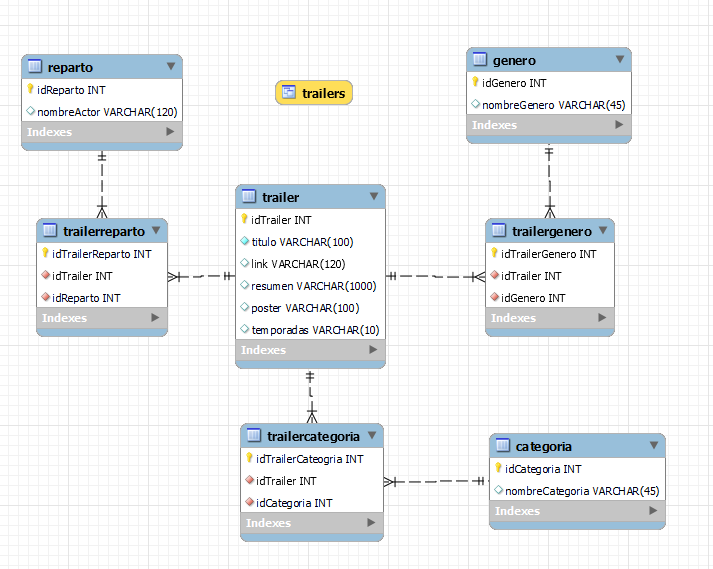
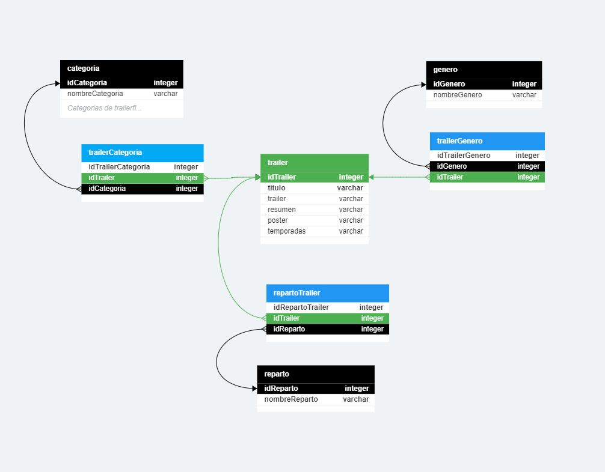

# Tercer proyecto integrador
#### Creación de una base de datos sobre trailers, conexión y visualización de los datos con Sequelize y Express en Node JS.

---

### Endpoints disponibles 

| Ruta | Descripción | Parámetros | Respuesta
|---|---|---|---|
| **`/`** | Ruta principal o home. :house: | :x: | Una lista en formato JSON de todos los endpoints accesibles.| 
| **`/catalogo`** | Ruta para obtener **todos los trailers** existentes en la base de datos. Consulta equivalente a `SELECT * FROM`. :books: | :x: | Todos los trailers con toda su información. |
| **`/categorias`** | Muestra todas las **categorías** existentes. | :x: | Todas las categorías que existen en la base de datos. |
| **`/generos`** | Muestra todos los **géneros** existentes. | :x: | Todos los géneros que existen en la base de datos.| 
| **`/catalogo/id/:id`** | Encuentra un trailer por **ID**. Consulta equivalente a `WHERE ID = :id`. | **`:id (int)`** El ID del trailer a buscar. | El trailer buscado por ID que se envía en el path, con toda su información. |
| **`/catalogo/nombre/:nombre`** | Busca trailers por parte del **nombre**. Consulta equivalente a `LIKE %:nombre%`. | **`:nombre (string)`**  El nombre del trailer o los trailers a buscar. | Todos los trailers encontrados con el nombre enviado en el path. |
| **`/catalogo/genero/:genero`** | Encuentra trailers coincidentes con cierto **género**. Consulta equivalente a `LIKE %genero%`. | **`:genero (string)`**  El género de los trailers a buscar. | Todos los trailers que coinciden con el género enviado en el path.|
| **`/catalogo/categoria/:categoria`** | Encuentra trailers coincidentes con cierta **categoría**. Consulta equivalente a `WHERE categoria = :categoria`. | **`:categoria (string)`**  Categoría de los trailers a buscar. | Los trailers donde su categoría coincide exactamente con el nombre de categoría enviado en el path.|
| **`/catalogo/reparto/:actor`** | Muestra los trailers asociados al nombre del **actor**. Consulta equivalente a `LIKE %actor%`. :dancer: | **`:actor (string)`**  Nombre del actor del que se quieren buscar los trailers. | Los trailers en donde participa el actor. |

+ *Todas las rutas son accesibles a través de un servidor local (al inicializarlo con `npm start`). Por ejemplo `localhost:3008/catalogo`*
+ *Todos los endpoints se encuentran desarrollados en el archivo [server.js]('https://github.com/nicofpalma/PROYECTO3-UNTREF/blob/main/server.js').*
+ *El modelo de Sequelize para interpretar los campos que se reciben de la base de datos, se encuentra en el archivo [trailers.js](https://github.com/nicofpalma/PROYECTO3-UNTREF/blob/main/src/models/trailers.js) (src/models/trailers.js).*
+ *El archivo de configuración que contiene toda la configuración de Sequelize para conectarse a la base de datos, se encuentra en el archivo [config.js](https://github.com/nicofpalma/PROYECTO3-UNTREF/blob/main/src/config/config.js) (src/config/config.js).*
+ *El archivo .env para configurar los parámetros como DB_SCHEMA, DB_USER, PORT, etc, se espera que se encuentre dentro del directorio [src/config](https://github.com/nicofpalma/PROYECTO3-UNTREF/tree/main/src/config).*
+ *Adjunté el archivo [trailerflix.json](https://github.com/nicofpalma/PROYECTO3-UNTREF/blob/main/trailerflix.json) porque modifiqué algunos errores que había sobre el mismo en la información. Por ejemplo, donde aparecía el género 'Sci-Fi', lo cambié por 'Ciencia Ficción'. Esa fue la base que usé para construir la base de datos y luego las inserciones en la misma.*
---

### Respuestas JSON de los endpoints
| Campo | Tipo | Descripción | Ejemplo |
|---|---|---|--|
|**`response`**| Array JSON | La respuesta de la base de datos se almacena en este campo. Es una lista de objetos JSON con lo que devuelve MySQL.| :heavy_check_mark: `"response": [{"idTrailer": 1,"titulo": "...","link": "...", "resumen": "...","poster": "...","temporadas": "...","categoria": "...","generos": "...","reparto": "..."}, {...}]`   :x: `"response": []`|
|**`success`**| Booleano | Devuelve `true` si la base de datos pudo encontrar elementos coincidentes con la consulta y si no hubo ningún error. Devuelve `false` en caso contrario. | :heavy_check_mark: `"success": true`   :x: `"success": false`|
|**`msg`**| String | Un mensaje que indica lo que pasó con la consulta, da un mejor detalle sobre el estado de éxito o error. | :heavy_check_mark: `"msg": "Todos los trailers encontrados con éxito"`   :x: `"msg": "No se encontraron trailers"` |
|**`error`**| String | Sólo aparece cuando hubo un error con la conexión a la base de datos, o un error en el parámetro requerido para el endpoint. | :x: `"error": "El parámetro "id" debe ser numérico"`   :x: `"error": "Error al intentar recuperar los trailers"` |

+ *:x: &rarr; Cuando es una respuesta de error o cuando no se encontró ninguna coincidencia.*
+ *:heavy_check_mark: &rarr; Cuando es una respuesta de éxito.*
+ *La elección de los campos de respuesta (y sus nombres) fue pensada para luego poder ser tratada de forma genérica y entendible por el frontend.*

---

### Documentación 
El código fue documentado con el formato de **JSDoc**, ya que es un formato fuertemente aceptado y distribuído. 

La documentación se realiza sobre cada porción de código, ya sea sobre constantes, objetos, funciones o módulos. Cuenta con una descripción de para qué sirve esa porción de código, los parámetros que recibe y qué retorna.

Captura de ejemplo:

---

### Base de datos
Toda la información de los endpoints se extrae de la **vista SQL llamada "trailers"**, donde se genera la unión de todas las tablas, para poder ver toda la información relacionada a los trailers, tal como se ve puede ver en el archivo "trailerflix.json". Luego, a esa vista se le realiza consultas con Sequelize para poder acceder a los datos.

+ *Hay un archivo en donde está la gran parte de inserciones y selects que trabajé para lograr construir la base de datos por completo, [consultasProyecto3.sql](https://github.com/nicofpalma/PROYECTO3-UNTREF/blob/main/consultasProyecto3.sql).*

#### Creación de la vista trailers:

+ Algunas consideraciones sobre la creación de la vista:
  + **`COALESCE(t.link, 'Sin link') AS link`** *&rarr; Reemplaza los valores nulos por el texto 'Sin link' (cuando el trailer no contiene un link a youtube)*.
  + **`CASE WHEN t.temporadas = 'N/A' THEN 'Sin temporadas' END AS temporadas`** *&rarr; Reemplaza el valor 'N/A' por el texto 'Sin temporadas' cuando el campo `temporadas` contiene ese valor.*
  + **`GROUP_CONCAT(DISTINCT g.nombreGenero SEPARATOR ', ') AS generos`** &rarr; *Separa los géneros de cada trailer con comas y los almacena en el campo generos, ya que cada trailer puede tener varios géneros.*
  + **`GROUP_CONCAT(DISTINCT r.nombreActor SEPARATOR ', ') AS reparto`** &rarr; *Separa los nombres de los actores con comas y los almacena en el campo reparto, ya que cada trailer tiene varios actores.*

 

#### Relaciones de tablas en la base de datos

+ **Desde MySQL Workbench**:

+ **Desde DB Designer**:

---

## Ejemplo de código

Este es un ejemplo de código, mostrado con la ruta **/catalogo/id/:id**, donde hay comentarios línea a línea para que se pueda entender como funciona el mismo.

<pre lang="javascript">
/** (Documentación en formato JSDoc)
 * Ruta para encontrar un trailer por ID.
 *
 * @route GET /catalogo/id/:id
 * @desc Busca y devuelve un trailer de la base de datos, que se busca por el ID que se pasa en el path.
 *
 * @param {Request} req Objeto de solicitud.
 * @param {Response} res Objeto de respuesta.
 *
 * @param {number} id ID del trailer a buscar.
 *
 * @returns {JSON} Trailer encontrado, o un mensaje de error si no se encuentra.
 *
 * @throws {Error} Error al intentar recuperar los trailers por ID.
 */
app.get('/catalogo/id/:id', async (req, res) => {  // Ruta GET /catalogo/id/:id
    // Bloque Try-Catch para control de errores
    try {                       
        const trailerId = req.params.id; // Obtiene el ID enviado en el path

        // Controla que el ID sea numérico
        if (isNaN(trailerId)) {         
            // Si el ID no es numérico, retorna un mensaje de error con estado 400 (error del cliente), y avisa el motivo con un mensaje de error.
            return res.status(400).json({
                error: 'El parámetro "id" debe ser numérico',
                success: false,
                msg: 'Por favor, proporcione un valor numérico válido para encontrar un trailer por ID'
            });
        };

        // Control de ID valido
        if (trailerId <= 0) {
            // Retorna un mensaje de error con estado 400 cuando el ID es igual o menor a 0, ya que los trailers comienzan con ID = 1
            return res.status(400).json({
                error: 'El parámetro "id" debe ser mayor a 0',
                success: false,
                msg: 'Por favor, proporcione un valor numérico mayor a 0 para encontrar un trailer por ID'
            });
        };

        // Obtiene el trailer a través de la función de sequelize findByPK. Obtiene un trailer con el ID enviado en el path.
        const trailer = await Trailer.findByPk(trailerId);

        !trailer
            // Si no encontró nada, devuelvo error 404 (no encontrado)
            ? res.status(404).json({
                response: [],       // Devuelvo un array vacío en el caso de no encontrar el trailer
                success: false,
                msg: `No se encontró el trailer con ID ${trailerId}`
            })
            // Si encontró algo, lo devuelvo
            : res.status(200).json({
                response: trailer,      // Devuelvo el trailer encontrado aquí en response
                success: true,
                msg: `Trailer con ID ${trailerId} encontrado con éxito`
            });
    } catch (error) {
        // Respuesta de error del servidor con estado 500 si hubo un problema al conectarse con la base de datos.
        res.status(500).json({
            error: 'Error al intentar recuperar los trailers por ID',
            success: false,
            msg: 'Mensaje de error: ' + error.message
        });
    };
});
</pre>
